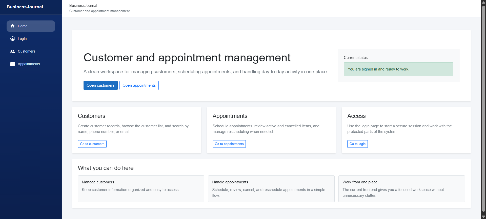
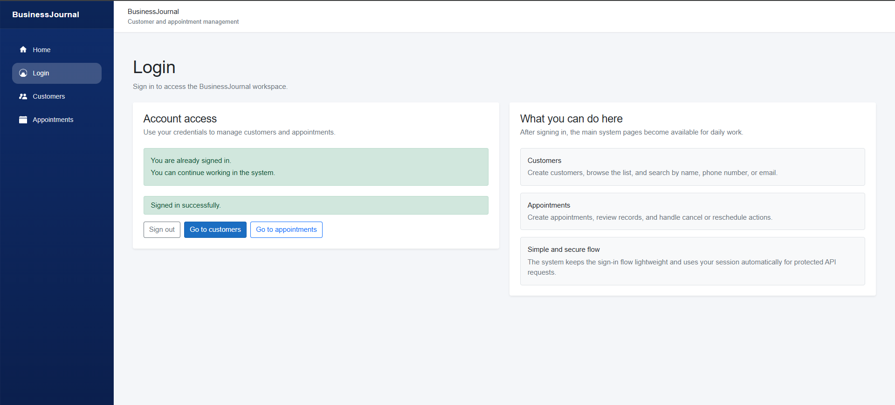
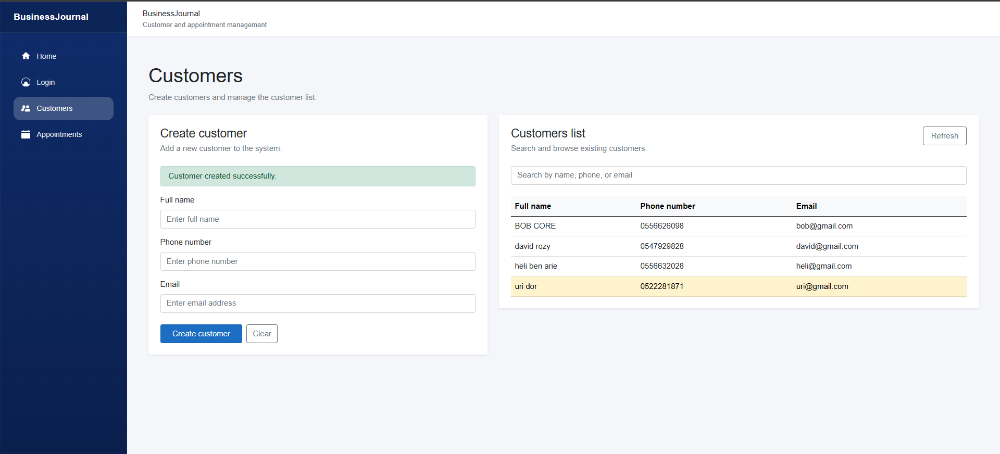
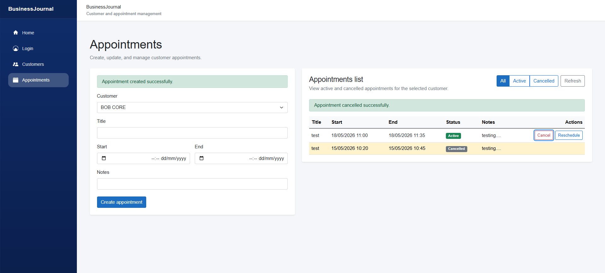

# BusinessJournal

> 91 tests passing | Clean Architecture | SQL Server | JWT Auth | Rate Limiting

BusinessJournal is an end-to-end customer and appointment management system built with a strong backend focus.

The project reflects real-world backend development practices: clean architecture, separation of concerns, SQL-based persistence, authentication, rate limiting, and automated tests.

---

## What this system does

- Register and manage customers
- Schedule appointments
- Prevent overlapping appointments
- Cancel and reschedule appointments
- Protect endpoints with JWT authentication
- Provide a Blazor frontend that consumes the API

---

## Tech Stack

Backend:
- .NET 8
- ASP.NET Core Web API
- SQL Server
- JWT Authentication
- Rate Limiting

Frontend:
- Blazor Server
- HttpClient API clients

Testing:
- xUnit
- 91 passing tests

---

## Architecture

The solution is split into clear layers:

- BusinessJournal.Domain  
  Core entities and value objects (Customer, Appointment, AppUser, TimeRange)

- BusinessJournal.Application  
  Services and use cases (CustomerService, AppointmentService, AuthService)

- BusinessJournal.Infrastructure  
  SQL access, repositories, connection factory, security (JWT, hashing)

- BusinessJournal.Api  
  Controllers, authentication, rate limiting, exception handling

- BusinessJournal.Web  
  Blazor frontend

- BusinessJournal.Tests  
  Tests for all layers

---

## SQL and Persistence

- SQL Server with explicit SQL scripts
- Schema scripts under `database/`
- SqlServerConnectionFactory manages connections
- Repository pattern (pragmatic)
- No ORM abstraction (intentional)

---

## Authentication and Security

- JWT authentication
- Dedicated auth service
- Password hashing (ASP.NET Identity)
- Protected endpoints
- Token attached automatically in frontend

---

## Rate Limiting

- API-level rate limiting
- Prevents abuse (login brute-force)
- Production-minded design

---

## Business Rules

- TimeRange value object
- Overlapping appointments rejected
- Logic handled in application layer
- Controllers stay thin

---

## Testing

91 passing tests across:

- Domain
- Application
- Infrastructure
- API
- Web

---

## Running the project

Run API:
cd src/BusinessJournal.Api
dotnet run

Run frontend:
cd src/BusinessJournal.Web
dotnet run

Run tests:
dotnet test tests/BusinessJournal.Tests/BusinessJournal.Tests.csproj

---

## Screenshots

Home:

Login:

Customers:

Appointments:

---

## Design Goals

- Clean and readable code
- SOLID where it matters
- Clear separation of concerns
- No over-engineering
- End-to-end working system

---

## Author

Built as part of my journey toward a backend developer role (C# / .NET).